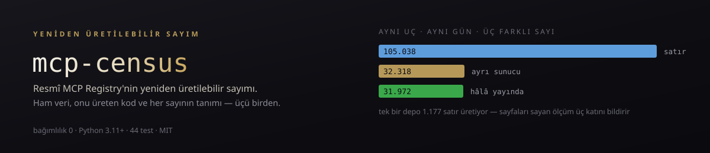
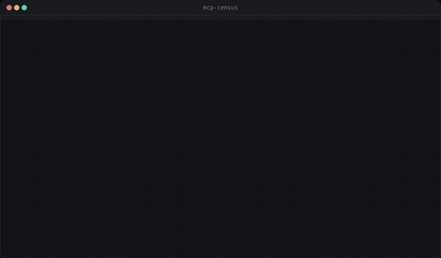
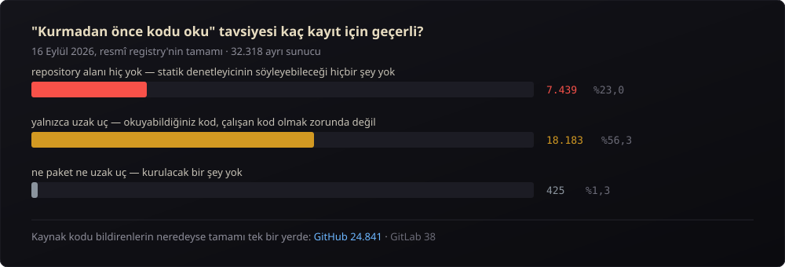

<div align="center">

[](https://github.com/Furkiozknn/mcp-census/actions/workflows/ci.yml)

### **Resmî MCP Registry'nin yeniden üretilebilir sayımı.**

*Kaç sunucu var, kaçının okunacak kodu var, kaçı sizin makinenizde hiç çalışmıyor.*



<sub>Gerçek çıktı, ağ olmadan: <code>veri/</code> klasöründeki indirilmiş anlık görüntüden üretiliyor, bu yüzden aynı komut yarın da aynı sayıları veriyor.</sub>

<br/>


</div>

<details>
<summary><b>In English</b></summary>

<br>

**A reproducible count of the official MCP Registry.** It answers how many servers there are, how many have code you can read, and how many never run on your machine. The raw data, the code that produced each number and the definition of each number are all in this repository, so anyone can re-derive the numbers. The rest of this README is in Turkish.

On 16 September 2026 the whole registry was downloaded:

| Question | Answer |
|---|---:|
| Rows the `/v0/servers` endpoint returns | **105,038** |
| Distinct servers | **32,318** |
| Still `active` | **31,972** |

The endpoint returns one row per **version**, not per server. The mean is 3.25 versions per server, but the median is 1, so the inflation comes from a few repositories; one server alone accounts for 1,177 rows. Counting pages and calling the result "N servers" therefore overstates the total about threefold. The registry's `?version=latest` filter returns exactly one row per server (`mcp-census indir --surum latest`).

**A quarter of the registry has no code you can read.** 23.0% of servers declare no `repository` at all. 56.3% offer only a remote endpoint and no downloadable package, so whatever code you can read is not necessarily the code that runs.

```bash
uv run mcp-census --veri veri/ornek say      # a 500-record sample ships with the repo
uv run mcp-census --veri veri/ornek rapor
uv run mcp-census indir --surum latest       # the only command that uses the network
```

`say` (count), `rapor` (report) and `karsilastir` (compare two snapshots) read only files on disk. Zero dependencies. The suite never touches the network.

</details>

---

## Neden

MCP ekosistemi hakkında dolaşan sayıların neredeyse tamamı tek bir satıcının
tek seferlik taramasından geliyor: *"kayıt defterinde N sunucu var"*,
*"popüler sunucuların %66'sında güvenlik bulgusu var"*. Bu sayılar
tartışılamıyor, çünkü ne veri ne de tarayıcı yayında. Yanlış olduklarını
göstermenin bir yolu yok — doğru olduklarını göstermenin de.

`mcp-census` bunun yerine üç şeyi birden veriyor: **ham veri**, **onu üreten
kod**, ve **her sayının tanımı**. Aynı komutu çalıştıran herkes aynı sonucu
alır; almıyorsa aradaki fark ölçülebilir (`mcp-census karsilastir`).

## İlk bulgu: "kaç sunucu var" sorusunun cevabı üçe katlanabiliyor

16 Eylül 2026'da resmî registry'nin tamamı indirildi.

| Soru | Cevap |
|---|---:|
| `/v0/servers` ucu kaç **satır** döndürüyor? | **105.038** |
| Kaç **ayrı sunucu** var? | **32.318** |
| Kaçı hâlâ **yayında** (`active`)? | **31.972** |

Fark, sunucu başına değil **sürüm** başına bir satır dönmesinden geliyor.
Sunucu başına ortalama 3,25 sürüm var — ama **medyan 1**. Yani şişmenin
kaynağı geniş bir eğilim değil, birkaç depo:

```
io.github.brilliantdirectories/brilliant-directories-mcp   1.177 sürüm
ai.bowmark/bowmark                                           828 sürüm
io.github.devantler-tech/ksail                               439 sürüm
```

Tek bir sunucu 1.177 satır üretiyor. Sayfaları sayıp "registry'de N sunucu
var" diyen bir ölçüm bu yüzden üç katı bir sayı bildirir.

**Doğru yol var ve kullanılmıyor:** registry `?version=latest` süzgecini
destekliyor ve tam olarak sunucu başına bir satır döndürüyor —
`mcp-census indir --surum latest`.

## İkinci bulgu: registry'nin dörtte birinin okunacak kodu yok



| Ölçüm | Sunucu | Oran |
|---|---:|---:|
| `repository` alanı **hiç yok** | 7.439 | **%23,0** |
| Yalnızca uzak uç sunuyor, indirilebilir paket yok | 18.183 | **%56,3** |
| Ne paket ne uzak uç bildiriyor — kurulacak bir şey yok | 425 | %1,3 |

İkisi de "kurmadan önce kodu oku" tavsiyesini doğrudan ilgilendiriyor:

- **%23'ünde okunacak kaynak yok.** Depo adresi bildirilmemiş. Statik bir
  denetleyici bu kayıtlar hakkında hiçbir şey söyleyemez.
- **%56'sı yalnızca uzak uç.** Okuyabildiğiniz kod, çalışan kod olmak
  zorunda değil; sunucu tarafında ne çalıştığını göremezsiniz.

Kaynak kodu olanların neredeyse tamamı GitHub'da (24.841), GitLab'de yalnızca
38 tane.

### Taşıma ve paketleme dağılımı

```
uzak uç          streamable-http 19.193 · sse 1.081
paket            npm 8.907 · pypi 3.785 · mcpb 1.221 · oci 919 · nuget 116 · cargo 51
durum            active 31.972 · deprecated 346
```

## Sayının kendisi hareket ediyor — ve bunu ölçüyoruz

Tam indirme ile `?version=latest` indirmesi arasında 15 dakika vardı. İkisi
farklı sayı verdi: **32.318** ve **32.321**.

```console
$ mcp-census karsilastir veri/kayitlar.jsonl veri/kayitlar-latest.jsonl
eski     32318 sunucu
yeni     32321 sunucu
eklenen      3   kaybolan 0

Fark yalnızca eklemeden ibaret; iki indirme arasında registry büyümüş. Sayım tutarlı.

eklenenler (ilk 50):
  + com.byjg/docs
  + com.docketnexus/docketnexus
  + io.github.API-Disk-Integrations/agent-mandate
```

**Kaybolan sıfır.** Fark tamamen ekleme — yani iki ölçüm arasında registry üç
sunucu büyümüş, indirmenin bir yeri eksik kalmamış. Bu ayrım önemli olduğu
için komut kayıp gördüğünde **çıkış 1** veriyor: CI'da eksik kalmış bir
indirme sessizce geçemez.

## Kullanım

```bash
uv sync                      # bağımlılık yok, sadece paket kurulumu
uv run mcp-census indir      # registry'yi çeker -> veri/kayitlar.jsonl + manifest.json
uv run mcp-census say        # sayımı üretir (ağ yok)  -> veri/sayim.json
uv run mcp-census rapor      # okunur metin (ağ yok)
```

Ağa çıkan tek komut `indir`. `say`, `rapor` ve `karsilastir` yalnızca diskteki
dosyaları okur — bu yüzden bir sayıya itiraz eden kişi aynı `kayitlar.jsonl`
ile aynı sonucu üretir.

```bash
uv run mcp-census rapor --json                 # makine okunur
uv run mcp-census rapor --yaz RAPOR.txt        # dosyaya da yaz
uv run mcp-census indir --azami-sayfa 5        # hızlı deneme (sayım TAM DEĞİL işaretlenir)
uv run mcp-census indir --surum latest         # sunucu başına tek satır -> veri/kayitlar-latest.jsonl
uv run mcp-census karsilastir eski.jsonl yeni.jsonl
```

Denemek için önce indirmeye gerek yok — depoda 500 kayıtlık örnek var:

```bash
uv run mcp-census --veri veri/ornek say
uv run mcp-census --veri veri/ornek rapor
```

## Tasarım

**İndirme ile yorum ayrı.** `fetch.py` registry ne döndürdüyse onu yazar,
hiçbir şeyi yorumlamaz. Sayım ayrı bir adım. Böylece aynı ham veri üzerinde
başka biri başka bir analiz yazabilir, ya da aynı analizi yıllar sonra
yeniden koşturabilir.

**Her sayı tanımını taşır.** Bir `Bulgu` üç şey tutar: değer, tanım, payda.
Rapor tanımları da basar. Bir sayım aracında asıl kırılgan yer aritmetik
değil, "sunucu" kelimesinin ne demek olduğunun sessizce kaymasıdır — testler
tam olarak bunu koruyor.

**Künye, ölçümün kimliğidir.** Her indirme yanına bir `manifest.json` bırakır:
kaynak, zaman, sayfa sayısı ve satırların sha256 özeti. Aynı özeti üreten iki
indirme aynı veriyi görmüştür. "Hangi anlık görüntüye bakıyoruz" sorusunun
cevabı budur.

**Kısmi indirme tam sayım gibi görünmez.** `--azami-sayfa` kullanıldığında
künyeye `tam_mi: false` yazılır, rapor bunu başlıkta uyarı olarak basar ve
komut stderr'e uyarı verir.

**Bağımlılık yok.** Bir ölçüm aracının kurulumunun kendisi bir tedarik
zinciri sorusu haline gelmemeli. Yalnızca standart kütüphane.

```
mcp_census/
  fetch.py     sayfalama, yeniden deneme, künye, JSONL okuma/yazma
  analyze.py   sayım, dağılımlar, iki indirmenin karşılaştırması
  cli.py       indir / say / rapor / karsilastir
```

## Testler

```bash
uv run pytest        # 55 test
```

Hiçbiri ağa çıkmaz: `fetch` fonksiyonları test edilebilir bir `getirici`
alıyor, CLI testleri `_istek`'i yamalar. Testlerin koruduğu şeyler arasında
şunlar var: 4xx yeniden denenmez ama 5xx denenir, tekrar eden imleç sonsuz
döngüyü keser, sürüm satırları dağılımları şişirmez, ve **hiçbir bulgu
paydasından büyük olamaz** (koruma yasası).

## Bilinen sınırlar

- **Yalnızca resmî registry.** mcp.so, Smithery, Glama gibi başka kataloglar
  kapsam dışı. Oradaki sayılar bu sayımdan farklı çıkar ve çıkması normaldir.
- **Registry'nin kendi beyanına bakılır.** Bir kaydın `repository` alanı
  varsa "kaynak var" sayılıyor; o adresin gerçekten var olduğu, kaydın
  gerçekten o depodan geldiği doğrulanmıyor. Provenans ayrı bir iş — bunun
  için [`mcp-vet`](https://github.com/Furkiozknn/mcp-vet).
- **Kod okunmuyor.** Bu bir güvenlik tarayıcısı değil, bir sayım aracı.
  "%23'ünün kodu yok" cümlesi bir güvenlik iddiası değil, bir
  **denetlenebilirlik** ölçümü.
- **`isLatest` yoksa varsayım yapılır.** Sürüm işaretlenmemişse o adın en son
  görülen satırı alınır. Ölçülen veride bütün adlarda `isLatest` vardı
  (32.318 ad, 32.318 işaretli satır) ama kod bu varsayımı yine de taşıyor.

## Lisans

MIT.

---

## Aynı soru, aylar sonra

Tek bir sayım bir fotoğraftır. `veri/sayim.json` 16 Eylül 2026'da ölçüldü ve o
günden sonra registry'nin nereye gittiğini söylemiyor — oysa bir sayım aracının
asıl değeri orada: "kaç sunucunun okunacak kodu yok" sorusunun cevabı artıyor
mu, azalıyor mu?

`Sayim` iş akışı ayda bir kez indiriyor, sayıyor, önceki sayımla ölçüt ölçüt
karşılaştırıyor ve [`veri/zaman-serisi.csv`](veri/zaman-serisi.csv) dosyasına bir
satır ekliyor. Sayılar oynamadıysa hiçbir şey commit etmiyor.

Ham kayıtlar depoda durmuyor ve durmayacak: 105 bin satır, her ay yeniden.
Duran şey hesaplanmış sayım, onu üreten manifest ve serinin o ayki satırı —
üçü birlikte, ham veriye erişimi olmayan birinin de seriyi okuyabilmesi için
yeterli.

```bash
mcp-census karsilastir veri/ornek/kayitlar.jsonl yeni.jsonl   # iki indirme
```

Ölçülmeyen bir ölçüt seride **boş** kalıyor, sıfıra çevrilmiyor: "o gün
ölçülmedi" ile "o gün sıfırdı" aynı şey değil, ve bir zaman serisinde bu fark
her şeydir. Sütun sırası sabit ve bir testle kilitli; bir CSV'nin sütun sırası
değişirse eski satırlar okunamaz hâle gelir.

## Bu ekosistemden başka projeler

- **[ajans-os](https://github.com/Furkiozknn/ajans-os)** — araştırma-önce kurulmuş, ADR ve sözleşmeli bir ajans OS'u
- **[mcp-vet](https://github.com/Furkiozknn/mcp-vet)** — bir MCP sunucusunun kaynağını kurmadan önce denetler

<sub>Hepsi tek bir aranabilir sayfada: **[furkiozknn.github.io](https://furkiozknn.github.io/)** — her kart, o deponun kendi <code>project-meta.json</code> dosyasından üretiliyor.</sub>
